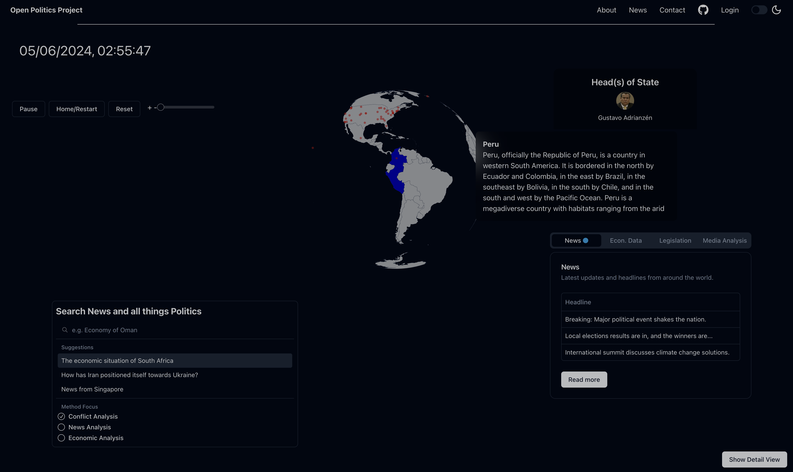

#### 🚧 UNDER CONSTRUCTION 🚧
# 🌐 Open Politics 
## Open Source Political Intelligence

### Onboarding:
Open Politics' vision is to democratise political intelligence. 

The mission is to create an open-source data science and AI toolkit to analyse, summarise, and visualise political information.

## Table of Contents
- [Why Open Politics Exists](#why-open-politics-exists)
- [Update: SSARE Release](#update-ssare-release)
- [The Webapp](#the-webapp)
- [Engage! Developer Jour Fixe](#engage-developer-jour-fixe)
- [Tasks](#tasks)
- [AI Models](#ai-models)
- [Data Challenges](#data-challenges)
- [Journalistic Challenges](#journalistic-challenges)
- [Quality Assurance](#quality-assurance)
- [Architecture](#architecture)
- [Usage](#usage)
- [Necessary API Keys/Environment Variables](#necessary-api-keysenvironment-variables)
- [Contributing](#contributing)
- [Contact](#contact)
- [License](#license)

As a quick pitch element to get you interested; this is where we are going:

# Why Open Politics Exists
- All things regarding politics, be they news, conflicts or legislative procedures, are hard to keep track of. It's hard to find the time to read through all the documents and news articles necessary to gain a broad and well-informed understanding of political situations. Technology offers great possibilities to make such processes more accessible. Recently, the advent of Large Language Models has extended the capabilities of textual analysis and understanding. Especially the ability to formulate tasks in natural language opens up new possibilities for analysing text data. Potentially revolutionising the way qualitative and quantitative research can be combined.
- This project aims to combine the best of natural language LLM interfacing and classical Data Science methods to build tools that provide a comprehensive overview of political topics, including summaries of news articles, information about political actors, and the relationships between them.
- The goal of this project is to make politics more accessible and understandable for everyone.

### Update: SSARE Release
#### [SSARE - (Semantic Search Article Recommendation Engine)](https://github.com/JimVincentW/SSARE)
SSARE is Open Politics' data aggregation system and vector storage endpoint. It aims to create up-to-date and relevant datasets for the LLMs to work with. A microservice infrastructure continuously scrapes news sites and stores them in a vector storage and a relational database (Postgres). Sources can be added with Python scripts which yield a dataframe with: URL | Headline | Paragraphs | Source. Just clone the service, add your scripts and bring your own data endpoint into production.

### The Webapp (Overview):
25.06.2024: 
**The Django stack is now replaced by a FastAPI backend + NextJS Frontend.**
The stack setup & is largely based on Tiangolo's Fullstack Template. 
Security and configuration updates will be fetched from the template.

Backend:
FastAPI, Postgres, Adminer \
The API's can be generated into OpenAPI clients. 
For the prototype some static data is served to illustrate future purposes (like the leaders of countries, articles on the globe, etc.).
The rest of the data is pulled from APIs, SSARE (https://github.com/JimVincentW/SSARE) and storages like Tavily, Bundestag API, OECD API, etc.

**The methodic layer** of what information is presented and when is currently buried in the frontend with the help of the Vercel AI SDK. The plan is to dynamically choose data analysis and presentation methods that are presented as streaming generative interfaces. 

Once it is more clear how FastAPI can provide the same capabilities as the Vercel AI SDK, the methodic layer will be moved to the backend. 

Frontend:
The frontend is now a Next.js app using shadcn as a UI library, amcharts for the globe and axios data fatches to the backend. The roamdap foresees that Open Politics will provide a unified interface for data resource management.

## Want to engage? Look into our Developer Jour Fixe!
- Interested in the project? Want to contribute? Share a thought?
- Every Wednesday 15:30 Berlin Time
- [Discord Server](https://discord.gg/KAFPp2KQ?event=1219348620860588123)
Join and talk about the project, ask questions, propose ideas, or just listen in.  
Currently needed:
- Data Scraper Modules 
- Interdisciplinary collaboration on the instruction sets for the LLMs 
- Prompt Engineering suggestions
- Frontend/UX/UI work

## Tasks
MVP Elements:
- Issue Area Identification
- Actor Identification / Named Entity Recognition
- Stance Triangulation

Including but not limited to tasks like:
- Information summarization
- Vector storage & retrieval 
- Information clustering
- Entity Extraction (Named Entity Recognition)
- Q&A Chatbots (for interactive information)
- Providing historical context 
- Statement & Intention decoding
- Visual representation of political data
- Monitoring and alerts
- Fact-checking (information triangulation)

## AI Models
- Open-Source is our friend.
- Developing consistent and reliable AI methods is hard with API based models. We thus aim to use open-source models and frameworks, e.g. Ollama and Huggingface for model inference and Langchain for prompt engineering.
- More concrete information on the actual setup is laid out in the [Architecture](#architecture) section.

## Data Challenges
- Addressing training data bias
- Effective prompt engineering
- Creating Datasets & Benchmarks
- Robust and scalable data pipelines
- Training and fine-tuning LLMs

## Journalistic Challenges
- Balanced News Sources
- Fact-checking
- Interdependence of news sources
- Interdependence of summaries

## Quality Assurance
- Automatic Evaluation of Results Pipelines needed (conciseness, accuracy, bias weighting etc.)

# Architecture
## Frontend
#### The Challenge
A fundamental challenge this project has to tackle is how to make information and insights accessible. 

### Vision

The "Open Globe" Interface is set out to display articles and events interactively on a globe.
It should enable to browse global news exploratively.
Heatmap events, timeseries/ timeline scrolling and filter for issue areas are also on the roadmap.

### Current UI

This interface enables you to formulate two questions in natural language and retrieve relevant articles. The globe serves as an interaction component for country-related information.

The frontend is currently capable of rendering GDP, Wikipedia Description, Heads of State for each country on click & Legislative Data for Germany. 

Some showcase articles are encoded to locations on the map. This is to show the future of event & article mapping this project aims to achieve.

## Backend
### FastAPI
- We are transitioning away from Django and using a FastAPI backend now. The structure and configuration is largely based on Tiangolo's Fullstack Template ([https://github.com/tiangolo/full-stack-fastapi-template](https://github.com/tiangolo/full-stack-fastapi-template))
 
- As placeholders, before the SSARE data engine is fully integrated a geojson file is served articles to the globe.

## Usage (better build script upcoming)
- Clone the repo
