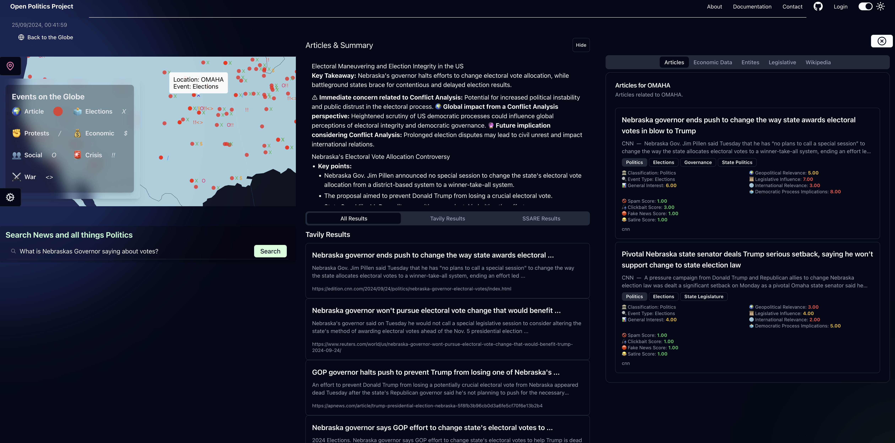

#### 🚧 UNDER CONSTRUCTION 🚧
# 🌐 Open Politics 
## Open Source Political Intelligence

### Onboarding:
Open Politics' vision is to democratise political intelligence. 

The mission is to create an open-source data science and AI toolkit to analyse, summarise, and visualise political information.

## Table of Contents
- [Why Open Politics Exists](#why-open-politics-exists)
- [Update: opol Release](#update-opol-release)
- [The Webapp](#the-webapp)
- [Engage! Developer Jour Fixe](#engage-developer-jour-fixe)
- [Tasks](#tasks)
- [AI Models](#ai-models)
- [Data Challenges](#data-challenges)
- [Journalistic Challenges](#journalistic-challenges)
- [Quality Assurance](#quality-assurance)
- [Architecture](#architecture)
- [Usage](#usage)
- [Necessary API Keys/Environment Variables](#necessary-api-keysenvironment-variables)
- [Contributing](#contributing)
- [Contact](#contact)
- [License](#license)

As a quick pitch element to get you interested; this is where we are going:



# Why Open Politics Exists
- All things regarding politics, be they news, conflicts or legislative procedures, are hard to keep track of. It's hard to find the time to read through all the documents and news articles necessary to gain a broad and well-informed understanding of political situations. Technology offers great possibilities to make such processes more accessible. Recently, the advent of Large Language Models has extended the capabilities of textual analysis and understanding. Especially the ability to formulate tasks in natural language opens up new possibilities for analysing text data. Potentially revolutionising the way qualitative and quantitative research can be combined.
- This project aims to combine the best of natural language LLM interfacing and classical Data Science methods to build tools that provide a comprehensive overview of political topics, including summaries of news articles, information about political actors, and the relationships between them.
- The goal of this project is to make politics more accessible and understandable for everyone.

### Update: opol Release
#### [opol - (Semantic Search Article Recommendation Engine)](https://github.com/JimVincentW/opol)
opol is Open Politics' data aggregation system and vector storage endpoint. It aims to create up-to-date and relevant datasets for the LLMs to work with. A microservice infrastructure continuously scrapes news sites and stores them in a vector storage and a relational database (Postgres). Sources can be added with Python scripts which yield a dataframe with: URL | Headline | Paragraphs | Source. Just clone the service, add your scripts and bring your own data endpoint into production.

**The methodic layer** 
1. The webapp integrates multiple APIs among which are Tavily, OECD, Bundestag, etc.
2. Most work regarding data infrastructure,ingestion, processing, classifications - is done in the opol microservices.
    - Furthermore opol concentrates on:
        - Search & Retrieval
        - Embedding, Entity & Geocoding Processing
        - OPP's custom dynamic semantic classification system 
            - Along the NLP Codebooks we use to classify content
        - Storage & Orchestration

3. The webapp serves the data to the frontend and our developed interfaceswhile integrating APIs where useful for extending the experience of an open source political intelligence system. However, opol is operable and useful as a standalone service.
4. The webapp is a NextJS app using mostly shadcn components - the globe is rendered with mapbox.


## Goal for the Open Politics Webapp
- opol is a data & infrastructure project. This webapp is a project of user interfaces. This distinction becomes valuable so we can avoid integrating new APIs & data sources which are only focused on small features or user experience enhacenments into a our carefully designed data infrastructure.

## Want to engage? Look into our Developer Jour Fixe!
- Interested in the project? Want to contribute? Share a thought?
- Every Wednesday 15:30 Berlin Time
- [Discord Server](https://discord.gg/KAFPp2KQ?event=1219348620860588123)
Join and talk about the project, ask questions, propose ideas, or just listen in.  
Currently needed:
- Data Scraper Modules 
- Interdisciplinary collaboration on the instruction sets for the LLMs 
- Prompt Engineering suggestions
- Frontend/UX/UI work


## AI Models
- Open-Source is our friend.
- Developing consistent and reliable AI methods is hard with API based models. We thus aim to use open-source models and frameworks, e.g. Ollama and Huggingface for model inference and Langchain for prompt engineering.
- More concrete information on the actual setup is laid out in the [Architecture](#architecture) section.

## Data Challenges
- Addressing training data bias
- Effective prompt engineering
- Creating Datasets & Benchmarks
- Robust and scalable data pipelines
- Training and fine-tuning LLMs

## Journalistic Challenges
- Balanced News Sources
- Fact-checking
- Interdependence of news sources
- Interdependence of summaries

## Quality Assurance
- Automatic Evaluation of Results Pipelines needed (conciseness, accuracy, bias weighting etc.)

## Usage/ Installation
## Clone the repository
```bash
git clone https://github.com/open-politics/open-politics.git
```

## Change .env.example to .env
```bash
cd open-politics
mv .env.example .env
```

## Run the docker compose file
```bash
docker compose up
```

## Go to the dashboard
```bash
http://localhost:3000/desk_synthese
```