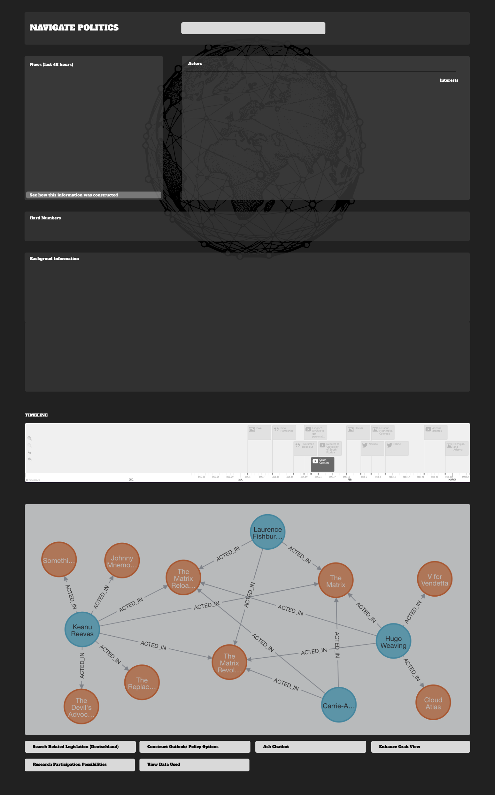

# 🚧 UNDER CONSTRUCTION 🚧

**Catchphrase:** Reducing politic's conteextual overhead.

# Why does this project exist?
- All things regarding politics, be that news or legislative procedures and documents are hard to understand. Many people don't have the time to read through all the documents and news articles.
- The goal of this project is to make political processes more accessible and understandable for everyone.

# Idea and Outline
This project aims to tackle two distinct problems:

1. Navigating political situations, legislative documents, and political processes is difficult and time-consuming.
2. Interacting with this data is often limited to a few experts.

**Solution Components:**
- News (Summarisation)
- Actors & Interests (Matrix)
- Background (filling the training cut-off)
- Hard Data Views (%s, numbers, etc.)
- Timeline View (of processes, events, and news)
- Graph View (of actors, interests, and processes)
- Chatbot (Q&A)
- Outlook (generative)


## Tasks
- Information summarization
- Entity Extraction (Named Entity Recognition)
- Q&A Chatbots (for interactive information)
- Providing historical context 
- Monitoring and alerts
- Visual representation of political data
- Fact-checking

## Data Science/ Code Challenges
- Addressing training data bias
- Effective prompt engineering
- Parsing/formatting outputs
- Training and fine-tuning LLMs

## Journalistic Challenges
- Balanced News Sources
- Fact-checking
- Interdependence of news sourcs
- Interdependence of summaries

## Quality Assurance
- Automatic Evaluation of Results Pipelines needed (conciseness, accuracy, etc.)


## Frontend

### Vision


- The frontend rendering and server communication is largely built on htmx features and tries to stay within the realm of HTML and CSS and Hyperstate Media, calling assets asynchronously.


## Backend

### Django

- Django is used as a backend framework to serve the frontend and to communicate with the LLMs.


### Langchain
- Each component requires different solutions
- - Langchain teams, agents, and chains are used to solve this problem.
- - Elaborate processes are done with tree tree-of-thought, chain-of-thought and reflextion (see papers).
- - Some tools require automatic code generation (e.g., for the graph or timeline view).
- Parses the document structure (e.g., bold text, headlines, lists).
- Sets of instructions are used to generate the output.
- Sets of instructions and sets of data are retrievable via Vecor Storage Querying (e.g., Chroma or Pinecone).


### Database 
- Vector Databases
- Neo4js

## Patterns & Tools of Analysis for LLMs
- Instruction Sets
- Skill/ Instruction Vector Storage
- Voyager Paper Technique


## Referenced Patterns/Papers
- Reflexion
- Tree of Thought
- Voyager

 with GUI

## Usage (coming soon):
- Clone the repo
- Install dependencies with
```
pip install -r requirements.txt
```
- Run the Django server
''''
python manage.py makemigrations
python manage.py migrate
python manage.py runserver
''''
- Connect to the frontend (open 127.0.0.1:8000 in your browser)
- Run the LLM agent (query the API)


## Necessary API Keys/ Environment Variables:
- DIP API (rgsaY4U.oZRQKUHdJhF9qguHMkwCGIoLaqEcaHjYLF)
- NewsAPI API
- OpenAI API
- Huggingface Token